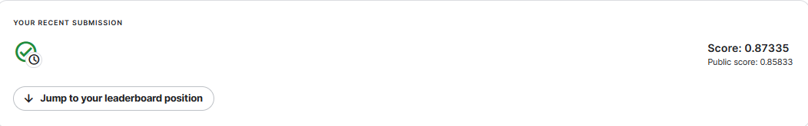

# Text-Classification-by-Embeddings

It takes text data and converts it into vectors before training it with a machine learning model.

link colab : https://colab.research.google.com/drive/1WfxCi8Vl1DkTb4Evaa30ntdRDHQXZTMI?usp=sharing <br>
sentence transformers : https://www.sbert.net/ <br>
kaggle : https://www.kaggle.com/competitions/fake-news/overview <br>
- Score: 0.87335 <br>
- Public score: 0.85833 <br>



<br>

---

How to install environment <br>

```
PYTHON VERSION 3.9.16 
pip install -r requirements.txt
```

Model Embeddings
  
```
from sentence_transformers import SentenceTransformer
model = SentenceTransformer('all-MiniLM-L6-v2')
```

Model Machine Learning <br>
- Sklearn : Multilayer Perceptron Classifier (MLP)
  
```
from sentence_transformers import SentenceTransformer
model = SentenceTransformer('all-MiniLM-L6-v2')
```

---
<br>
How to save and laod model [ Machine Learning ] <br>

- Save
```
import pickle
pickle.dump(( embedding , mlp), open('classificationv2.pkl', 'wb'))
```

- Load
```
import pickle
with open('/content/test3.pkl', 'rb') as f:
    embedding , mlp = pickle.load(f)
```
